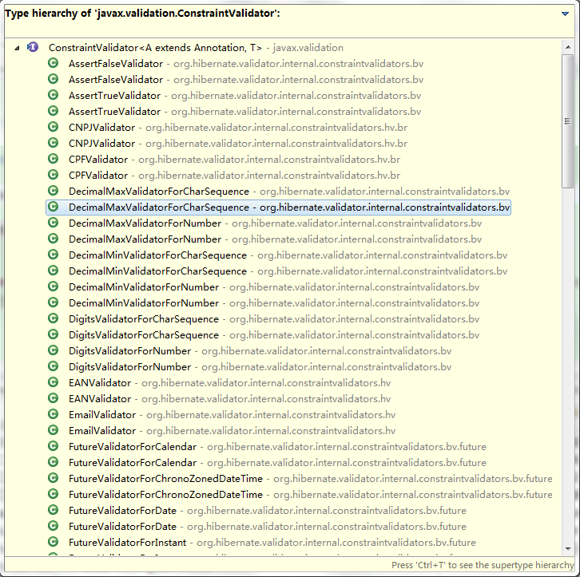

# 使用Bean Validation

##问题##
今天遇到一个bean属性验证的问题，场景如下:

```java
public class Test {
    private int type;
    private Test2 value;
}
public class Test2 {
    @NotNull
    private String name;
}
```

如果Test的type等于1时，需要对value进行验证，如果type不等于1时，不需要对type进行验证。

##分析##
1. bean validation是否能否满足？
2. hibernate的扩展实现能否满足？
3. 自己实现能否满足？
下面分别进行分析
###bean validation是否能否满足？###
查阅了一下bean validation，发现bean validation只提供了最基础的验证，比如`@Null,@NotNull`,显然是不满足需求的。
### hibernate的扩展实现能否满足？###
目前项目中使用的bean validation规范是hibernate的实现，具体还有什么实现没有去查。先打开一个注解，比如`@NotNull`,
```java
@Target({ METHOD, FIELD, ANNOTATION_TYPE, CONSTRUCTOR, PARAMETER })
@Retention(RUNTIME)
@Documented
@Constraint(validatedBy = { })
public @interface NotNull {
	String message() default "{javax.validation.constraints.NotNull.message}";
	Class<?>[] groups() default { };
	Class<? extends Payload>[] payload() default { };
}
```
再查看`@Constraint`注释，发现上面的三个方法是每个validation注释类所必需的。具体validate的类是`@Constraint`中`validatedBy`属性指定的类决定的，而且该类必需实现`ConstraintValidator<?,?>`接口。其中第一个泛型参数代表该注解，第二个泛型参数代表所注解的对象值。
下面是`@NotNull`所对应的validate类`NotNullValidator`的代码摘抄
```java
public class NotNullValidator implements ConstraintValidator<NotNull, Object> {
	public void initialize(NotNull parameters) {
	}
	public boolean isValid(Object object, ConstraintValidatorContext constraintValidatorContext) {
		return object != null;
	}
}
```
说了这么多，其实目的就是想查看hibernate中提供了哪些bean validation中没有的注解。怎么看呢？很简单了，通过查看`ConstraintValidator`的具体实现类即可

查看一下，有一些好玩的validator，比如`ScriptAssertValidator`，对应的注解是`ScriptAssert`，可以在类上注解来判断类中两个属性的值是否满足需求。
还有一个`ParameterScriptAssertValidator`，对应的注解是`ParameterScriptAssert`，可以在方法上注解来判断类中两个参数的值是否满足需求。
这些注解的用法hibernate都在对应的doc文档中有详细的描述。
不过仔细查看了一下这些hibernate提供的注解，也没有满足需求的
### 自己实现能否满足？###
自己实现的话有两种方案：
1. 自己实现注解和`ConstraintValidator`接口，在Test2变量上或者Test类上进行注解
2. 自己手工进行业务逻辑判断，然后再调用bean validation提供的方法对Test2类进行验证

如果自己实现注解和对应的接口，则可以参考上面提到的`ScriptAssertValidator`实现，具体的业务逻辑在脚本中实现，但实现起来难度较大。所以决定采用第二种方案来满足需求。
##解决##
通过网上对bean validation使用方法的搜索，于是有了如下的工具类
```java
public final class BeanValidator {
	/**
	 * 验证指定对象。如果验证失败，则抛出{@code AppException}
	 * @param object
	 */
	public static <T> void validate(T object) {
		validate(object, true);
	}
	/**
	 * 验证指定对象。如果验证失败，则抛出{@code AppException}
	 * @param object
	 * @param errorWhenNull 如果为null，是否被认为是错误
	 */
	public static <T> void validate(T object, boolean errorWhenNull) {
		if (object == null && errorWhenNull) {
			throw new AppException(ErrorCode.ERR_INVALID_PARAM);
		}

        //获得验证器
        Validator validator = Validation.buildDefaultValidatorFactory().getValidator();
        //执行验证
        Set<ConstraintViolation<T>> results = validator.validate(object);
        //如果有验证信息，则将第一个取出来包装成异常返回
        if (results.size() > 0) {
			ErrorCode errorCode;
			try {
				errorCode = ErrorCode.valueOf(results.iterator().next().getMessage());
			} catch (Exception e) {
				Logs.warn("", e);
				errorCode = ErrorCode.ERR_INVALID_PARAM;
			}
			throw new AppException(errorCode);
		}
    }
}
```
此时运行会报异常，
```java
javax.validation.ValidationException: HV000183: Unable to load 'javax.el.ExpressionFactory'. Check that you have the EL dependencies on the classpath, or use ParameterMessageInterpolator instead
	at org.hibernate.validator.internal.engine.ValidatorFactoryImpl.createValidator(ValidatorFactoryImpl.java:339) ~[hibernate-validator-5.2.2.Final.jar:5.2.2.Final]
	at org.hibernate.validator.internal.engine.ValidatorFactoryImpl.getValidator(ValidatorFactoryImpl.java:256) ~[hibernate-validator-5.2.2.Final.jar:5.2.2.Final]
```
可以参考这篇文章[Getting started with Hibernate Validator](http://hibernate.org/validator/documentation/getting-started/)，在pom文件中增加如下依赖
```xml
    <dependency>
       <groupId>javax.el</groupId>
       <artifactId>javax.el-api</artifactId>
       <version>${javax-el.version}</version>
    </dependency>
```
##思考##
刚开始遇到这个问题时，首先当然是想到用bean validation来对bean进行验证，显然不能通过bean validation提供的注解来完成对bean里嵌套的bean的验证，此时最容易想到的方法便是写代码对嵌套bean中属性的一一判断。虽然简单，但却失去了灵活性，通过进一步对bean validation的探寻，才能找到更好的方法。
##遗留问题##
上面还有一个问题没有找到对应的代码实现：注解和对应的`ConstraintValidator`实现是如何运行的？当然我们可以猜测是在对注解进行处理时读取注解的注解，然后找到`ConstraintValidator`的实现，再具体调用isValid方法来判断注解对应的变量是否通过验证。但是查看注解源码，比如上面提到的`@NotNull`，发现并没有指定Validator是`NotNullValidator`，我们可以继续猜测hibernate是通过配置文件将两者一一对应的。但所有这些都是猜测，没有看到hibernate对应的源码，这些问题对我们来说仍然是个问题。
当然我们并不关心hibernate如何去实现，但如果我们弄清楚了hibernate具体的实现，那我想对我们后续的编程也是大有裨益的，因为我们又掌握了一种思考及解决问题的方法。