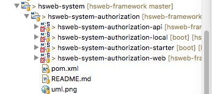

# hs-web简介、权限模块
## 简介
hs-web是一个用于快速搭建企业后台管理系统的基础项目,集成一揽子便捷功能如:通用增删改查，在线代码生成，权限管理，OAuth2.0 ,动态多数据源分布式事务，动态脚本，动态定时任务，在线数据库维护等等. 基于 spring-boot,mybaits。项目地址 [hs-web-framework](https://github.com/hs-web/hsweb-framework)。

## 目录结构
该项目的所有功能功能都是通过SpringBoot的starter的方式动态增加的，这点要牢记。
基本目录结构如下（以authorization为例）：

其中
* hsweb-system-authorization-starter模块为starter模块，
* hsweb-system-authorization-api模块包括service接口和entity实体类，
* hsweb-system-authorization-local模块包括service实现和dao接口，以及mybatis用到的mapper配置文件，
* hsweb-system-authorization-web模块为controller

看懂一个具体的模块，其它模块都是类似的结构，就非常好理解了。

下面就看具体的功能实现了。

## 权限管理
先从权限管理看起。
权限管理涉及到的模块有hsweb-authorization和hsweb-system-authorization。

在demo中，增加了@EnableAopAuthorize的注解来启动AOP权限控制。

@EnableAopAuthorize注解就定义在hsweb-authorization-basic模块中。该注解导入了两个类：AopAuthorizeAutoConfiguration和AuthorizingHandlerAutoConfiguration。

AuthorizingHandlerAutoConfiguration类中定义了很多的bean，其中就有负责登录的AuthorizationController的bean定义，还定义了两个WebMvcConfigurer的bean，twoFactorHandlerConfigurer只有在配置文件中配置了属性hsweb.authorize.two-factor且enable=true的时候才有效，而另外的webUserTokenInterceptorConfigurer优先级最高，在这个configurer中，增加了一个用户令牌拦截器WebUserTokenInterceptor，它继承自org.springframework.web.servlet.handler.HandlerInterceptorAdapter类，在每次方法调用之前，先将request请求解析成ParsedToken，如果返回为空，则返回true，否则，可能是用户已经登录，先踢出旧的token，再将新的token保存到UserTokenHolder中，其实就是ThreadLocal变量中。

AopAuthorizeAutoConfiguration类定义了两个比较重要的bean，DefaultAopMethodAuthorizeDefinitionParser类用来解析Authorize相关注解，而AopAuthorizingController类继承自org.springframework.aop.support.StaticMethodMatcherPointcutAdvisor，并且实现了org.springframework.boot.CommandLineRunner接口，这个类其实定义了一个切面，如果类定义了@Controller，@RestController注解，且方法定义了@Authorize注解，则会使用DefaultAopMethodAuthorizeDefinitionParser解析这些注解的方法，并返回是否支持。

```java
/**
*Perform static checking whether the given method matches. If this returns false or if the isRuntime() method returns false, no runtime check (i.e. no. matches(java.lang.reflect.Method, Class, Object []) call) will be made.
**/
public boolean matches(Method method, Class<?> aClass) {
    boolean support = AopUtils.findAnnotation(aClass, Controller.class) != null
            || AopUtils.findAnnotation(aClass, RestController.class) != null
            || AopUtils.findAnnotation(aClass, method, Authorize.class) != null;

    if (support && autoParse) {
        defaultParser.parse(aClass, method);
    }
    return support;
}
```
解析完成后，会在run中发布AuthorizeDefinitionInitializedEvent事件。通过搜索，发现在hsweb-system-authorization-starter的AutoSyncPermission类监听了AuthorizeDefinitionInitializedEvent事件，在onApplicationEvent方法中，会获取到所有解析到AuthorizeDefinition实例，然后会创建对应的实体，根据注解@ApiModelProperty设置名称，最后更新到数据库中。

AopAuthorizingController的构造方法传入了一个MethodInterceptor实例，其实就是在mathes方法返回true后动态调用该方法时执行的切面。这个要注意，**matches是静态判断方法是否匹配，如果匹配，则动态调用该方法时MethodInterceptor实例对应的invoke方法就会执行，也就是该类构造方法中传入的lambda表达式。** 在这个lambda表达式中，会判断如果Authentication.current()有值，则获取Authentication实例，否则抛出未授权异常。获取到Authentication实例后，就根据方法定义时的注解进行相应的权限判断。


