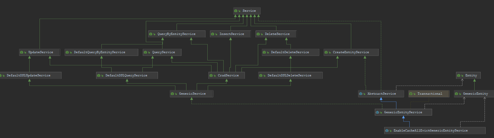

# hs-web中通用的controller、service、dao层结构及其相关

## 通用controller

hs-web中通用controller在hsweb-commons-controller模块中

最基础的有四个接口：`QueryController`、`UpdateController`、`CreateController`和`DeleteController`

`QueryController`中定义了通用的方法，如根据条件查询、根据条件分页查询、根据条件统计、根据主键查询等。所有方法都注解了`Authorize`，不需要鉴权的方法则设置`ignore`为true。泛型查询条件则继承了`Entity`

```java

/**
 * 通用查询控制器。
 *
 * @param <E>  实体类型
 * @param <PK> 主键类型
 * @param <Q>  查询条件实体类型,默认提供{@link QueryParamEntity}实现
 * @author zhouhao
 * @see QueryParamEntity
 * @see 3.0
 */
public interface QueryController<E, PK, Q extends Entity> {

    @Authorize(ignore = true)
    <T extends QueryByEntityService<E> & QueryService<E, PK>> T getService();

    @Authorize(action = Permission.ACTION_QUERY)
    @GetMapping
    @ApiOperation(value = "根据动态条件查询", responseReference = "get")
    default ResponseMessage<PagerResult<E>> list(Q param) {
        return ok(getService().selectPager(param));
    }

    @Authorize(action = Permission.ACTION_QUERY)
    @GetMapping("/no-paging")
    @ApiOperation(value = "不分页动态查询", responseReference = "get")
    default ResponseMessage<List<E>> listNoPaging(Q param) {
        if (param instanceof QueryParamEntity) {
            ((QueryParamEntity) param).setPaging(false);
        }
        return ok(getService().select(param));
    }

    @Authorize(action = Permission.ACTION_QUERY)
    @GetMapping("/count")
    @ApiOperation(value = "根据动态条件统计", responseReference = "get")
    default ResponseMessage<Integer> count(Q param) {
        return ok(getService().count(param));
    }


    @Authorize(action = Permission.ACTION_GET)
    @GetMapping(path = "/{id:.+}")
    @ApiOperation("根据主键查询")
    default ResponseMessage<E> getByPrimaryKey(@PathVariable PK id) {
        return ok(assertNotNull(getService().selectByPk(id)));
    }

    @Authorize(action = Permission.ACTION_GET)
    @GetMapping(path = "/ids")
    @ApiOperation("根据主键查询多条记录")
    default ResponseMessage<List<E>> getByPrimaryKey(@RequestParam List<PK> ids) {
        return ok(assertNotNull(getService().selectByPk(ids)));
    }

    @Authorize(ignore = true)
    static <T> T assertNotNull(T obj) {
        if (null == obj) {
            throw new NotFoundException("{data_not_exist}");
        }
        return obj;
    }

}
```

`CreateController`、`UpdateController`、`DeleteController`也类似，增加了模型到实体转化的`modelToEntity`抽象方法

`CrudController`继承了四个基础的controller接口，提供了默认的模型到实体转化方法

```java
public interface CrudController<E, PK, Q extends Entity, M>
        extends QueryController<E, PK, Q>
        , UpdateController<E, PK, M>
        , CreateController<E, PK, M>
        , DeleteController<E,PK> {

    @Override
    @SuppressWarnings("unchecked")
    @Authorize(ignore = true)
    CrudService<E, PK> getService();

    @Override
    @Authorize(ignore = true)
    default E modelToEntity(M model, E entity) {
        return FastBeanCopier.copy(model, entity);
    }
}
```

`SimpleCrudController`和`CrudController`接口类似，不过`modelToEntity`方法直接返回了模型，不需要进行别的映射

```java
public interface SimpleCrudController<E, PK, Q extends Entity>
        extends QueryController<E, PK, Q>
        , UpdateController<E, PK, E>
        , CreateController<E, PK, E>
        , DeleteController<E,PK> {

    @Override
    @SuppressWarnings("unchecked")
    @Authorize(ignore = true)
    CrudService<E, PK> getService();

    @Override
    @Authorize(ignore = true)
    default E modelToEntity(E model, E entity) {
        // model = entity
        return model;
    }
}
```

`GenericEntityController`接口继承了`CrudController`，对应的实体泛型继承的是`GenericEntity`

`SimpleGenericEntityController`接口继承了`SimpleCrudController`，对应的实体泛型继承的是`GenericEntity`

后续所有的controller都实现了这几个接口中的某一个，具体要看对应的业务逻辑

## 通用service

### 通用service接口定义

hs-web中通用service接口在hsweb-commons-service-api模块中

最基础的接口：`QueryService`、`UpdateService`、`InsertService`、`DeleteService`、`CreateEntityService`和`QueryByEntityService`。提供了基本的方法定义。它们都继承自标志接口`Service`

`CrudService`接口继承了上述6个基础接口

除了上面几个基础接口外，还提供了`TreeService`接口，提供了对树的基础操作

### 通用service接口实现

通用实现类在hsweb-commons-service-simple模块中

`DefaultQueryByEntityService`接口继承`QueryByEntityService`，提供了默认的实现

`DefaultDSLQueryService`接口继承`DefaultQueryByEntityService`和`QueryService`，增加了`QueryService`接口的默认实现

`DefaultDSLUpdateService`接口继承`UpdateService`，增加了`createUpdate`方法

`DefaultDeleteService`接口继承`DeleteService`，没有任何默认实现

`DefaultDSLDeleteService`接口继承`DefaultDeleteService`，增加了`createDelete`方法

`GenericService`接口继承`DefaultDSLQueryService`、`DefaultDSLUpdateService`、`DefaultDSLDeleteService`和`CrudService`

`AbstractService`抽象类实现了`CreateEntityService`接口。增加了通用的验证方法

`GenericEntityService`抽象类继承`AbstractService`，实现了`GenericService`接口

`EnableCacheAllEvictGenericEntityService`抽象类继承`GenericEntityService`接口，对每个方法增加了`Cacheable`或`CacheEvict`注解

类层次结构图如下



后续所有的service都会继承或实现上面提到的类或接口

## 通用dao

hs-web中通用dao在hsweb-commons-dao-api模块中

通用接口有如下几个：`InsertDao`、`DeleteDao`、`DeleteByEntityDao`、`QueryByEntityDao`和`UpdateByEntityDao`

`CrudDao`接口为通用接口的集成
