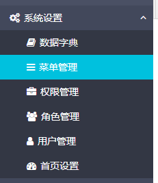
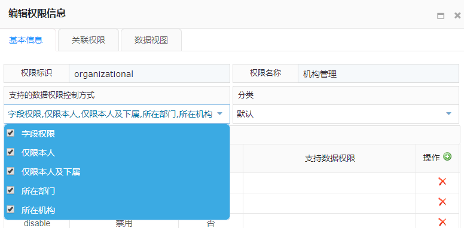

# hs-web界面权限部分操作

hs-web界面权限部分一直不怎么会操作。今天摸索后记录一下

默认admin用户是不需要鉴权的，所有操作都默认支持。可以参考[hs-web角色权限和数据权限验证逻辑](hs-web-rbac-data.md)

如果要将demo中`Application`类的如下代码注释后，发现admin没有任何操作权限

```java
    @EventListener

    public void onApplicationEvent(AuthorizingHandleBeforeEvent event) {
        //admin 拥有所有权限
        if (event.getContext().getAuthentication().getUser().getUsername().equals("admin")) {
            event.setAllow(true);
        }
    }
```

查看代码后发现用户的权限都是存储在表`s_autz_detail`中，默认启动后没有该表没有权限数据，所以如果注释掉则所有操作都没有权限

系统设置菜单下的子菜单及其作用：



- 数据字典：用于设置系统用到的数据字典。对应的表为`s_dictionary`、`s_dict_item`、`s_dict_parser`

- 菜单管理：用于管理系统的菜单，可以设置菜单的图标、名称、点击的url地址、权限id等。对应的表为`s_menu`

- 权限管理：用于设置系统菜单的通用权限，包括可以支持的数据权限控制方式、分类、关联的权限、数据视图的名称等。对应的表为`s_permission`

- 角色管理：用于管理系统的角色。对应的表为`s_role`

- 用户管理：用于管理系统的用户，包括修改用户密码、设置用户权限等。对应的表为`s_user`、`s_autz_detail`、`s_autz_menu`、`s_autz_setting`

- 首页设置：用于首页的设置。对应的表为`s_dashboard_conf`

以下以`组织架构->机构管理`菜单的权限配置来说明系统具体的权限配置操作：

1. 配置通用的数据权限控制方式
   
   点击权限管理菜单，选择机构管理记录，点击编辑
   
   
   
   弹出编辑权限对话框。其中：
   
   - 基本信息：用于设置权限的基本信息
   
   - 关联权限：用于设置权限的父权限
   
   - 数据视图：用于设置具体的数据字段名称与描述
   
   选择基本信息页签下的支持的数据权限控制方式，选择需要的分类，然后保存
   
   
   
   此时数据保存到了`s_permission`表中对应的权限记录下。说明此处修改的是全局的权限设置信息。

2. 配置指定用户下对应菜单的数据权限
   
   选择用户管理菜单，选择对应的用户，目前只有超级管理员用户，点击用户赋权按钮
   
   - 菜单设置：用于设置该用户对应的菜单权限，默认已经选中了所有的菜单，说明超级管理员是有所有菜单的权限的
   
   - 权限设置：用于设置该用户在对应菜单下的操作权限。
   
   选择权限设置页签下的机构管理节点，则右边可以配置机构管理菜单的数据权限，此时列出的数据权限选择项就是刚刚选择的数据权限控制方式。
   
   选择机构管理节点的任意一个一级子菜单，比如查询，可以设置查询操作的数据权限。
   
   选择二级子菜单，设置的是列级权限。比如去掉查询下的name、fullName，则查询时无法查出机构名称、机构全称两列的值

3. 测试
   
   关闭服务，将文章开始提到的代码注释掉。用于验证权限配置是否有效。
   
   测试发现设置列级权限后，界面并没有对应的变化（之前以为系统会根据二级子菜单的勾选来调整对应的列是否展示），只是查询时会将sql中对应的字段自动去掉

4. 
