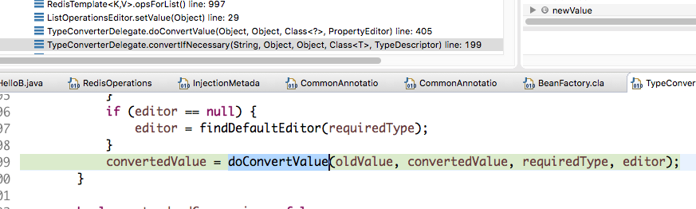
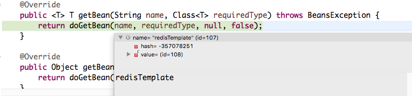
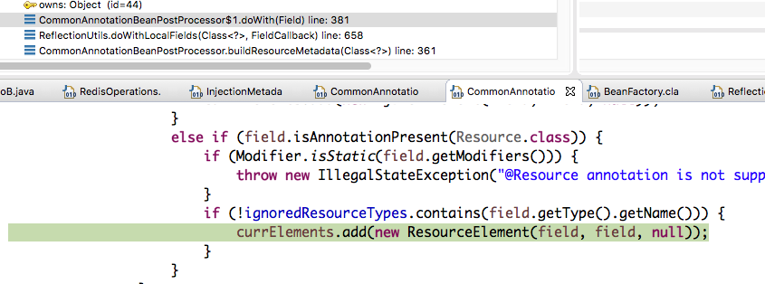

# 使用RedisTemplate的操作类访问Redis

这两天使用了spring提供的redisTemplate类访问redis，本来感觉使用起来没有什么难度，结果当我看官方文档时，被下面一段官方的事例代码搞晕了：

```java
public class Example {

  // inject the actual template
  @Autowired
  private RedisTemplate<String, String> template;

  // inject the template as ListOperations
  @Resource(name="redisTemplate")
  private ListOperations<String, String> listOps;

  public void addLink(String userId, URL url) {
    listOps.leftPush(userId, url.toExternalForm());
  }
}
```
有些疑问：

* RedisTemplate类注解了有什么用？
* ListOperations为什么不用@Autowired来注解？

Spring的官方文档里没有找到相关说明，只有自己去解惑了。（后续找到再进行补充）

先不说第一个问题，第二个问题好解决。

我们查看ListOperations的具体实现类就可以发现，ListOperations接口只有一个DefaultListOperations的实现类，而且这个类没有提供公有的构造函数，只提供的包级别访问的没有修饰符的构造函数，如下：

```java
class DefaultListOperations<K, V> extends AbstractOperations<K, V> implements ListOperations<K, V> {

	DefaultListOperations(RedisTemplate<K, V> template) {
		super(template);
	}
}
```

@Autowired注解是Spring通过注解扫描后再反射自动初始化bean的，而此时该类并没有相应的注解，所以如果使用@Autowired来注解，会报如下异常:

```
Field listOps in sample.data.redis.SampleRedisApplication required a bean of type 'org.springframework.data.redis.core.ListOperations' that could not be found.
```

那又引出了新问题：

* @Resource这种情况下怎么不会有问题？
* @Autowired和@Resource注解有什么区别？

要解答为何@Resource此时就可以起作用，还需要查看spring的源码。

将断点打在DefaultListOperations类的构造方法上，启动程序，进入断点后，在debug视图中找到void org.springframework.data.redis.core.ListOperationsEditor.setValue(Object value)方法，

```java
	public void setValue(Object value) {
		if (value instanceof RedisOperations) {
			super.setValue(((RedisOperations) value).opsForList());
		} else {
			throw new java.lang.IllegalArgumentException("Editor supports only conversion of type " + RedisOperations.class);
		}
	}
```
该方法中会调用RedisTemplate的opsForList方法将DefaultListOperations初始化，并设置到我们的bean中，那ListOperationsEditor类从哪里来的？还需要往下找。

我们现在找到了这个方法中：<T> T org.springframework.beans.TypeConverterDelegate.convertIfNecessary(String propertyName, Object oldValue, Object newValue, Class<T> requiredType, TypeDescriptor typeDescriptor) throws IllegalArgumentException方法，如下图：



由于刚开始时editor为空，肯定代码会进入findDefaultEditor方法中，

```java
private PropertyEditor findDefaultEditor(Class<?> requiredType) {
		PropertyEditor editor = null;
		if (requiredType != null) {
			// No custom editor -> check BeanWrapperImpl's default editors.
			editor = this.propertyEditorRegistry.getDefaultEditor(requiredType);
			if (editor == null && String.class != requiredType) {
				// No BeanWrapper default editor -> check standard JavaBean editor.
				editor = BeanUtils.findEditorByConvention(requiredType);
			}
		}
		return editor;
	}
```
查看注释，如果没有自定义editor，则获取默认的editor，进入PropertyEditor org.springframework.beans.BeanUtils.findEditorByConvention(Class<?> targetType)方法，发现默认的editor寻找逻辑，如下是该方法的部分注释：

```
Find a JavaBeans PropertyEditor following the 'Editor' suffix convention (e.g. "mypackage.MyDomainClass" -> "mypackage.MyDomainClassEditor").
```

现在就知道了，因为我们的类型是ListOperations，所以找到了ListOperationsEditor，这是Spring默认提供的editor。
接下来看RedisTemplate类是如何来的。
继续往下找，发现了getBean方法调用，如下：



发现name属性已经是redisTemplate了，还需要再往下找调用的地方，最后找到了InjectionMetadata org.springframework.context.annotation.CommonAnnotationBeanPostProcessor.buildResourceMetadata(Class<?> clazz)中ReflectionUtils.doWithLocalFields中的doWith方法，如下图：

此时可以看到spring解析了Resource注解，并通过name属性找到对应的bean，也就是redisTemplate了。

Spring代码大概看完了，现在也就知道了@Autowired和@Resource注解的区别。

**通常情况下，两者可以相互替换使用。但@Resource也可以通过类型+Editor方式提供字段的生成方式。**

不过话说回来了，redisTemplate类已经提供了opsForList方法获取ListOperations，需要的时候直接获取不就可以了吗？我想我后续是不会这么注解代码的。😄


