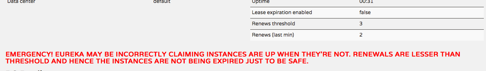

# Eureka监控页面

访问http://localhost:8761就会看到Eureka监控页面，如下所示


分为四部分，系统状态（System Status）、数据中心备份（DS Replicas）、当前注册到Eureka上的实例（Instances currently registered with Eureka）、通用信息（General Info）、实例信息（Instance Info）

## Eureka监控页面代码

在Service->Endpoints下可以看到我们访问的监控页面对应的方法为：`org.springframework.cloud.netflix.eureka.server.EurekaController#status`


`EurekaController`类的`status`方法如下：

```java
	@RequestMapping(method = RequestMethod.GET)
	public String status(HttpServletRequest request, Map<String, Object> model) {
		populateBase(request, model);
		populateApps(model);
		StatusInfo statusInfo;
		try {
			statusInfo = new StatusResource().getStatusInfo();
		}
		catch (Exception e) {
			statusInfo = StatusInfo.Builder.newBuilder().isHealthy(false).build();
		}
		model.put("statusInfo", statusInfo);
		populateInstanceInfo(model, statusInfo);
		filterReplicas(model, statusInfo);
		return "eureka/status";
	}
```

返回的是`eureka/status`,可以发现`/templates/eureka/`目录下的`status.ftl`文件。这个就是Eureka监控页面对应的代码了

## System Status

主要是系统的一些状态信息。包括：

* Environment：Eureka服务器环境，默认是test。可以使用如下配置去修改

```yaml
eureka:
  environment: prod
```

在Eureka服务器启动的时候会设置页面上对应的值

对应的代码位置

`org.springframework.cloud.netflix.eureka.server.EurekaServerBootstrap#initEurekaEnvironment`

```java
protected void initEurekaEnvironment() throws Exception {
		log.info("Setting the eureka configuration..");

		String dataCenter = ConfigurationManager.getConfigInstance()
				.getString(EUREKA_DATACENTER);
		if (dataCenter == null) {
			log.info(
					"Eureka data center value eureka.datacenter is not set, defaulting to default");
			ConfigurationManager.getConfigInstance()
					.setProperty(ARCHAIUS_DEPLOYMENT_DATACENTER, DEFAULT);
		}
		else {
			ConfigurationManager.getConfigInstance()
					.setProperty(ARCHAIUS_DEPLOYMENT_DATACENTER, dataCenter);
		}
		String environment = ConfigurationManager.getConfigInstance()
				.getString(EUREKA_ENVIRONMENT);
		if (environment == null) {
			ConfigurationManager.getConfigInstance()
					.setProperty(ARCHAIUS_DEPLOYMENT_ENVIRONMENT, TEST);
			log.info(
					"Eureka environment value eureka.environment is not set, defaulting to test");
		}
		else {
			ConfigurationManager.getConfigInstance()
					.setProperty(ARCHAIUS_DEPLOYMENT_ENVIRONMENT, environment);
		}
	}
```
    
*  Data center：数据中心名称，默认为default。可以使用如下配置去修改

```yaml
eureka:
  datacenter: ds1
```

代码同Environment

* Current time：当前服务器时间
* Uptime：服务器启动时间
* Lease expiration enabled：租期超时是否可用，也就是是否进入自我保护模式。如果为false，表明进入自我保护模式，客户端心跳超时不会被清除。如果为true，表明没有进入自我保护模式，客户端心跳超时后会被清除

从`navbar.ftl`中，可以看到，该值是从`registry.leaseExpirationEnabled`中获取的

```html
      <tr>
        <td>Lease expiration enabled</td>
        <td>${registry.leaseExpirationEnabled?c}</td>
      </tr>
```

`EurekaController`中获取registry的代码如下

```java
	private PeerAwareInstanceRegistry getRegistry() {
		return getServerContext().getRegistry();
	}

	private EurekaServerContext getServerContext() {
		return EurekaServerContextHolder.getInstance().getServerContext();
	}
```

可以查到`PeerAwareInstanceRegistryImpl`代码中对于的方法

```java
    public boolean isLeaseExpirationEnabled() {
        if (!isSelfPreservationModeEnabled()) {
            // The self preservation mode is disabled, hence allowing the instances to expire.
            return true;
        }
        return numberOfRenewsPerMinThreshold > 0 && getNumOfRenewsInLastMin() > numberOfRenewsPerMinThreshold;
    }
```

如果自我保护模式不可用，表明Eureka服务端会清除超时的客户端信息，所以直接返回true，如果自我保护模式可用，需要对`getNumOfRenewsInLastMin()`（上一分钟的续约次数）和`numberOfRenewsPerMinThreshold`（每分钟续约阈值）做比较。如果上一分钟的续约次数大于每分钟续约阈值，表明没有进入保护模式，会清除超时的客户端信息。查找代码，可以发现`numberOfRenewsPerMinThreshold`的计算方式如下

```java
@Override
    public void openForTraffic(ApplicationInfoManager applicationInfoManager, int count) {
        // Renewals happen every 30 seconds and for a minute it should be a factor of 2.
        this.expectedNumberOfRenewsPerMin = count * 2;
        this.numberOfRenewsPerMinThreshold =
                (int) (this.expectedNumberOfRenewsPerMin * serverConfig.getRenewalPercentThreshold());
        logger.info("Got {} instances from neighboring DS node", count);
        logger.info("Renew threshold is: {}", numberOfRenewsPerMinThreshold);
        
        ...        
}
```

30秒续约一次（即心跳周期30秒），所以一分钟要乘2。从打印信息来看，count为注册的实例数量。`count*2`算出的就是`expectedNumberOfRenewsPerMin`（每分钟期望续约数）。`numberOfRenewsPerMinThreshold`（每分钟续约的阈值）即为`expectedNumberOfRenewsPerMin`（每分钟期望续约数）`*` 续约百分比阈值。而续约百分比阈值是通过配置文件配置的，默认值为0.85

```yaml
eureka:
  server:
    renewal-percent-threshold: 0.85
```

* Renews threshold：续约阈值。查看代码，发现获取的值就是`numberOfRenewsPerMinThreshold`（每分钟续约的阈值）

* Renews(last min)：上一分钟续约次数。

_***上面三个属性的对应关系为：如果Renews threshold不为0且Renews(last min) > Renews threshold，则Lease expiration enabled为true，否则为false***_

***当Lease expiration enabled为false时，说明已经进入自我保护模式，此时会在界面上显示如下内容***


其实查看`navbar.ftl`代码，发现不止一种上面的提示信息

```html
<#if isBelowRenewThresold>
    <#if !registry.selfPreservationModeEnabled>
        <h4 id="uptime"><font size="+1" color="red"><b>RENEWALS ARE LESSER THAN THE THRESHOLD. THE SELF PRESERVATION MODE IS TURNED OFF.THIS MAY NOT PROTECT INSTANCE EXPIRY IN CASE OF NETWORK/OTHER PROBLEMS.</b></font></h4>
    <#else>
        <h4 id="uptime"><font size="+1" color="red"><b>EMERGENCY! EUREKA MAY BE INCORRECTLY CLAIMING INSTANCES ARE UP WHEN THEY'RE NOT. RENEWALS ARE LESSER THAN THRESHOLD AND HENCE THE INSTANCES ARE NOT BEING EXPIRED JUST TO BE SAFE.</b></font></h4>
    </#if>
<#elseif !registry.selfPreservationModeEnabled>
    <h4 id="uptime"><font size="+1" color="red"><b>THE SELF PRESERVATION MODE IS TURNED OFF.THIS MAY NOT PROTECT INSTANCE EXPIRY IN CASE OF NETWORK/OTHER PROBLEMS.</b></font></h4>
</#if>
```

再查看对应代码的`isBelowRenewThresold`方法

```java
    public int isBelowRenewThresold() {
        if ((getNumOfRenewsInLastMin() <= numberOfRenewsPerMinThreshold)
                &&
                ((this.startupTime > 0) && (System.currentTimeMillis() > this.startupTime + (serverConfig.getWaitTimeInMsWhenSyncEmpty())))) {
            return 1;
        } else {
            return 0;
        }
    }
```

发现并不是Lease expiration enabled为false时就会显示上面的提示信息，而是还会在启动后等待waitTimeInMsWhenSyncEmpty时间才会显示，默认为5分钟，可以通过如下配置。加这个时间主要是在等待注册信息完成

```yaml
eureka:
  server:
    wait-time-in-ms-when-sync-empty: 5 * MINUTES
```

## DS Replicas

显示的是Eureka服务端备份列表，也就是`peerEurekaNodes`，即配置的Eureka多实例

## Instances currently registered with Eureka

显示的是当前注册到Eureka上的实例。是一个表格的形式展示。每个实例名称是表格一行

* Application
    
    实例名称。显示的是spring.application.name
    
* AMIs：
    
    Amazon元数据信息。如果数据中心为Amazon时，则显示ami-id的信息，否则显示n/a。然后括号里显示的是对应的实例数
    
* Availability Zones

    Amazon可用区域信息。如果数据中心为Amazon时，则显示availability-zone信息，否则显示空。然后括号里显示的是对应的实例数
    
* Status

    实例状态信息。包括实例状态，各个实例的id（eureka.instance.instanceId配置）以及对应的url地址（eureka.instance.status-page-url-path配置）
    
## General Info

通用信息。包括如下内容：

|  名称  |  含义  |
| --- | --- | 
| total-avail-memory |  可用内存 |
| environment | 服务器环境 |
| num-of-cpus | cpu数量 |
| current-memory-usage | 当前内存使用量 |
| server-uptime | 运行时长 |
| registered-replicas | 注册的备份服务器 |
| unavailable-replicas | 不可用的备份 |
| available-replicas | 可用的备份 |

## Instance Info

该实例的信息。包括如下内容：

|  名称  |  含义  |
| --- | --- | 
| ipAddr | 该服务器的ip地址 |
| status | 该服务器状态。包括如下几种：UP（正常，等待接收流量）、DOWN（不发送流量，健康检查回调失败）、STARTING（启动状态，初始化未完成，不发送流量）、OUT_OF_SERVICE（关闭流量）。具体参考com.netflix.appinfo.InstanceInfo.InstanceStatus |


    
    

