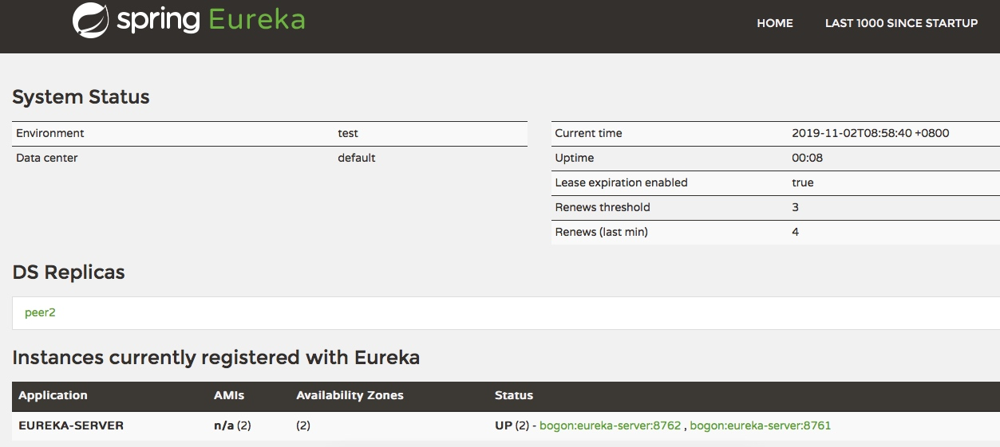
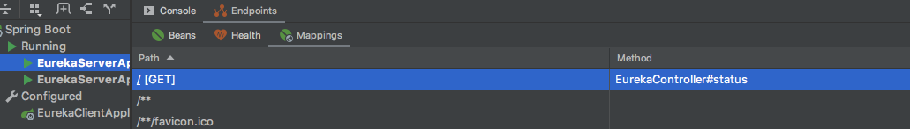

# Eureka监控页面

访问http://localhost:8761就会看到Eureka监控页面，如下所示


分为四部分，系统状态（System Status）、数据中心备份（DS Replicas）、当前注册到Eureka上的实例（Instances currently registered with Eureka）、通用信息（General Info）、实例信息（Instance Info）

## Eureka监控页面代码

在Service->Endpoints下可以看到我们访问的监控页面对应的方法为：`org.springframework.cloud.netflix.eureka.server.EurekaController#status`



`EurekaController`类的`status`方法如下：

```java
	@RequestMapping(method = RequestMethod.GET)
	public String status(HttpServletRequest request, Map<String, Object> model) {
		populateBase(request, model);
		populateApps(model);
		StatusInfo statusInfo;
		try {
			statusInfo = new StatusResource().getStatusInfo();
		}
		catch (Exception e) {
			statusInfo = StatusInfo.Builder.newBuilder().isHealthy(false).build();
		}
		model.put("statusInfo", statusInfo);
		populateInstanceInfo(model, statusInfo);
		filterReplicas(model, statusInfo);
		return "eureka/status";
	}
```

返回的是`eureka/status`,可以发现`/templates/eureka/`目录下的`status.ftl`文件。这个就是Eureka监控页面对应的代码了

## 系统状态（System Status）

主要是系统的一些状态信息。包括：

* Environment：Eureka服务器环境，默认是test。可以使用如下配置去修改

```yaml
eureka:
  environment: prod
```

在Eureka服务器启动的时候会设置页面上对应的值

对应的代码位置

`org.springframework.cloud.netflix.eureka.server.EurekaServerBootstrap#initEurekaEnvironment`

```java
protected void initEurekaEnvironment() throws Exception {
		log.info("Setting the eureka configuration..");

		String dataCenter = ConfigurationManager.getConfigInstance()
				.getString(EUREKA_DATACENTER);
		if (dataCenter == null) {
			log.info(
					"Eureka data center value eureka.datacenter is not set, defaulting to default");
			ConfigurationManager.getConfigInstance()
					.setProperty(ARCHAIUS_DEPLOYMENT_DATACENTER, DEFAULT);
		}
		else {
			ConfigurationManager.getConfigInstance()
					.setProperty(ARCHAIUS_DEPLOYMENT_DATACENTER, dataCenter);
		}
		String environment = ConfigurationManager.getConfigInstance()
				.getString(EUREKA_ENVIRONMENT);
		if (environment == null) {
			ConfigurationManager.getConfigInstance()
					.setProperty(ARCHAIUS_DEPLOYMENT_ENVIRONMENT, TEST);
			log.info(
					"Eureka environment value eureka.environment is not set, defaulting to test");
		}
		else {
			ConfigurationManager.getConfigInstance()
					.setProperty(ARCHAIUS_DEPLOYMENT_ENVIRONMENT, environment);
		}
	}
```
    
*  Data center：数据中心名称，默认为default。可以使用如下配置去修改

```yaml
eureka:
  datacenter: ds1
```

代码如上

* Current time：当前服务器时间
* Uptime：服务器启动时间
* Lease expiration enabled：租期超时if


