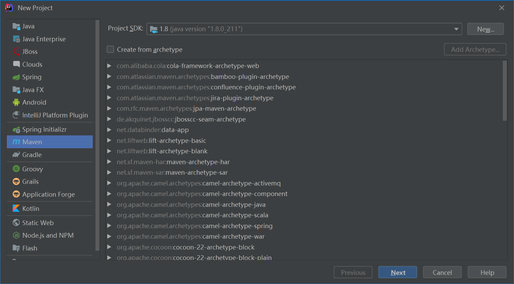
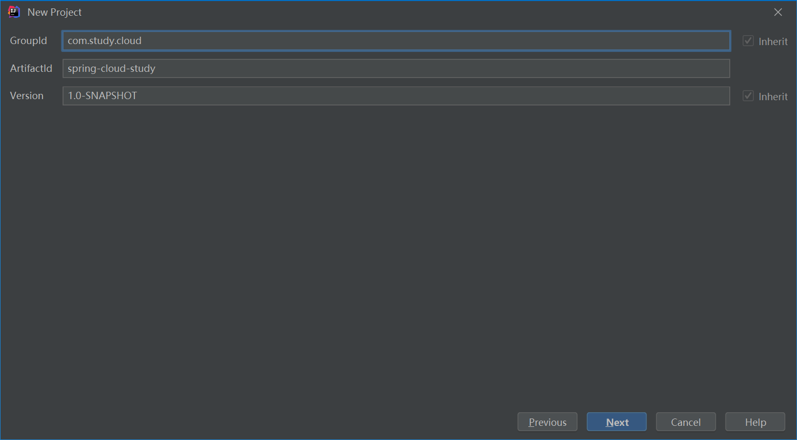
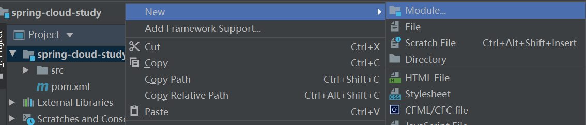
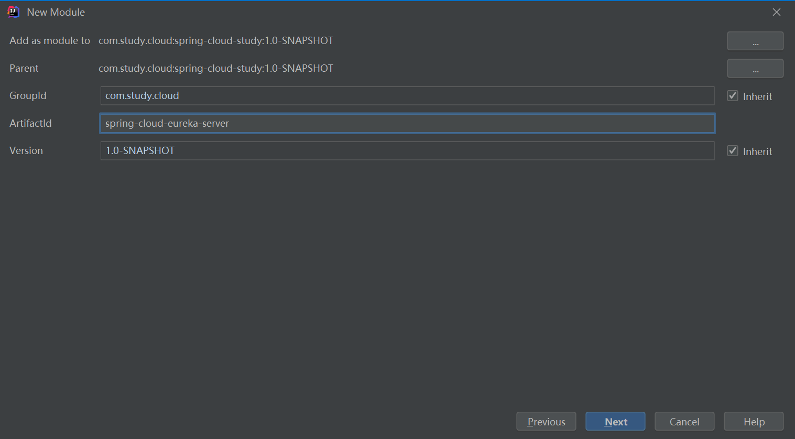
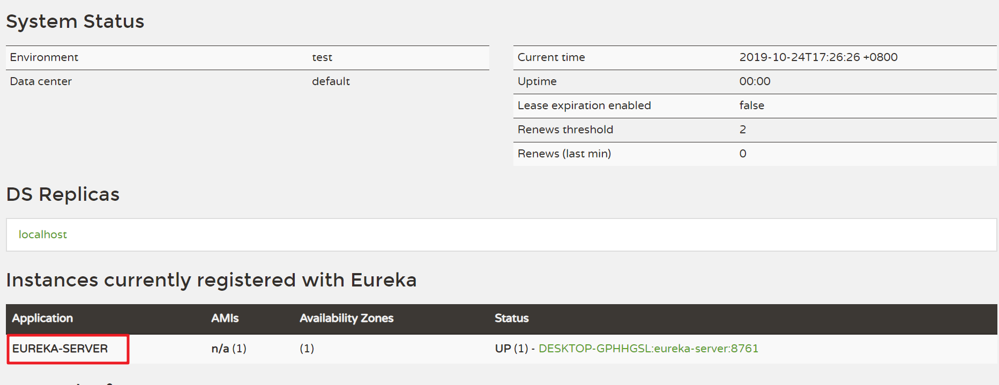

# Eureka服务端和客户端的创建

##  创建服务注册中心（Eureka服务端）

1. 创建maven父工程

   新建一个工程

   

   点击下一步，输入groupid为com.study.cloud，artifactid为spring-cloud-study

   

   下一步修改project的名称为spring-cloud-study，点击完成

2. 创建maven子工程

   在新建的maven工程上点击右键

   
   
   输入artifactid为spring-cloud-eureka-server
   
   
   
   修改module名称为spring-cloud-eureka-server，点击完成
   
3. 将spring-cloud-study工程下的src文件夹删除。因为spring-cloud-study工程为父工程，不需要src目录

4. 修改spring-cloud-study下的pom.xml，增加SpringBoot和SpringCloud的dependencyManagement配置以及相关的属性配置

   ```xml
    <properties>
           <java.version>1.8</java.version>
           <encoding>UTF-8</encoding>
           <spring-boot-version>2.0.9.RELEASE</spring-boot-version>
           <spring-cloud-version>Finchley.SR4</spring-cloud-version>
    </properties>
   <dependencyManagement>
        <dependencies>
           <dependency>
               <!-- Import dependency management from Spring Boot -->
               <groupId>org.springframework.boot</groupId>
               <artifactId>spring-boot-dependencies</artifactId>
               <version>${spring-boot-version}</version>
               <type>pom</type>
               <scope>import</scope>
           </dependency>
   		<dependency>
   			<groupId>org.springframework.cloud</groupId>
   			<artifactId>spring-cloud-dependencies</artifactId>
   			<version>${spring-cloud-version}</version>
   			<type>pom</type>
   			<scope>import</scope>
   		</dependency>
       </dependencies>
   </dependencyManagement>
   ```

5. 在spring-cloud-eureka-server工程的pom中，增加相应依赖

   ```xml
   <dependencies>
           <dependency>
               <groupId>org.springframework.cloud</groupId>
               <artifactId>spring-cloud-starter-netflix-eureka-server</artifactId>
           </dependency>
       </dependencies>
   ```

   

6. 在spring-cloud-eureka-server工程中新建java类，EnableEurekaServer注解说明是eureka服务端

   ```java
   @SpringBootApplication
   @EnableEurekaServer
   public class EurekaServerApplication {
       public static void main(String[] args) {
           SpringApplication.run(EurekaServerApplication.class, args);
       }
   }
   ```

7. 增加配置文件application.yml

   ```yaml
   server:
     port: 8761
   
   spring:
     application:
       name: eureka-server
   ```

8. 启动工程，在浏览器中访问 http://localhost:8761 ，可以看到相应页面

   

   其中红色框的内容就是在yml文件中配置的应用名称

9. 因为我们现在搭建的是eureka服务端，而只有客户端的应用才应该注册到服务端，现在需要修改yml文件，增加如下配置

   ```yaml
   eureka:
     instance:
       hostname: localhost
     client:
       register-with-eureka: false
       fetch-registry: false
       service-url:
         defaultZone: http://${eureka.instance.hostname}:${server.port}/eureka
   ```

    通过eureka.client.register-with-eureka：false和fetch-registry：false来表明自己是一个eureka服务端

   现在重启，就会发现页面中那个红色框的内容已经不在了

## 创建服务提供者（Eureka客户端）

1. 创建子工程spring-cloud-eureka-client。类似于上面的步骤，不再重复
   
2. 新建java类EurekaClientApplication，EnableEurekaClient注解说明是eureka客户端

   
```java
@SpringBootApplication
@EnableEurekaClient
public class EurekaClientApplication {
    public static void main(String[] args) {
        SpringApplication.run(EurekaClientApplication.class, args);
    }
}
```
 
3. 新建application.yml，配置内容如下
   
```yaml
server:
  port: 8771
    
spring:
  application:
    name: eureka-client
    
eureka:
  client:
    service-url:
      defaultZone: http://localhost:8761/eureka
  instance:
    prefer-ip-address: true
```
其中defaultZone表明注册中心的地址，也就是将自己注册到哪个Eureka服务端
    
4. 启动EurekaClientApplication类，发现客户端服务一启动就立刻退出。网上查了一下，说是要加SpringBoot web的依赖，在spring-cloud-study工程的pom文件中，增加如下依赖

```xml
<dependency>
    <groupId>org.springframework.boot</groupId>
    <artifactId>spring-boot-starter-web</artifactId>
</dependency>
```

5. 再次启动EurekaClientApplication类，顺利完成启动。在浏览器中访问 http://localhost:8761，可以看到有一个eureka-client应用已经注册到服务端了。

eureka最基本的注册中心和客户端大概总结完了。下一次，记录一下[eureka其它特性](eureka2.md)。

   

