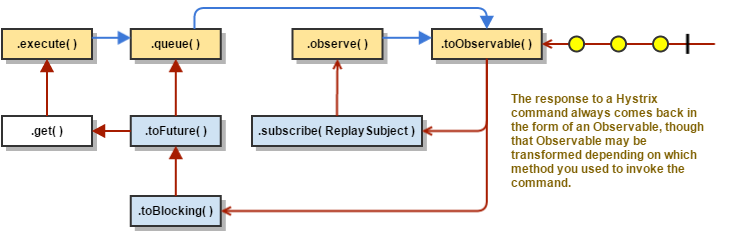

# Hystrix是如何工作的

## 流图


1. 构造 `HystrixCommand`或`HystrixObservableCommand`对象
   
   构造 `HystrixCommand`或`HystrixObservableCommand`对象来代替你发起的请求。将请求需要的参数传递给构造函数。
   
   如果返回单个响应，则构造`HystrixCommand`对象
   
   ```
   HystrixCommand command = new HystrixCommand(arg1, arg2);
   ```
   
   如果返回的是持续发出响应的Observable对象，则构造`HystrixObservableCommand`对象
   
   ```
   HystrixObservableCommand command = new HystrixObservableCommand(arg1, arg2);
   ```

2. 执行命令
   
   执行命令有四种方式（前两种适用于`HystrixCommand`，并不适用于`HystrixObservableCommand`）
   
   - `execute()`：返回单一的响应（或当发生错误时抛出异常）之前一直阻塞
   
   - `queue()`：返回`Future`对象，可以使用它来获取单一响应
   
   - `observe()`：订阅代表响应的`Observable`对象，返回`Observable`对象的副本
   
   - `toObservable()`：返回`Observable`对象，当你订阅它时，会执行Hystrix命令并产生响应
     
     ```
     K             value   = command.execute();
     Future<K>     fValue  = command.queue();
     Observable<K> ohValue = command.observe();         //hot observable
     Observable<K> ocValue = command.toObservable();    //cold observable
     ```
   
   同步方法`execute()`调用`queue().get().queue()`，而它又调用`toObservable().toBlocking().toFuture()`。最终每一个`HystrixCommand`都是使用[`Observable`](http://reactivex.io/documentation/observable.html)的实现，即使是返回单个响应的命令。

3. 响应是否被缓存？
   
   如果命令的请求缓存可用，并且该请求的响应在缓存中可用，那么缓存的响应会立即以`Observable`的形式返回。参见请求缓存。

4. 是否断路器打开？
   
   当执行Hystrix命令时，它会检查断路器是否打开。
   
   如果断路器打开，Hystrix不会执行命令，但会路由到第8点

5. 是否线程池/队列/信号量已满？
   
   如果与命令相关的线程池和队列（或者当不在线程中运行时为信号量）满了时，Hystrix不会执行命令，而是直接路由到第8点

6. `HystrixObservableCommand.construct()`或者`HystrixCommand.run()`
   
   这里Hystrix调用的请求依赖于你写的方法的目的
   
   - `HystrixCommand.run()`：返回单个响应或抛出异常
   
   - `HystrixObservableCommand.construct() `：返回一个Observable对象来产生响应或发送`onError`通知
   
   如果`run()`或者`construct()`方法调用超时，线程将抛出`TimeoutException`异常（如果命令不在自己的线程中运行，则会有单独的定时器线程抛出异常）。在这种情况下Hystrix会通过第8点路由响应，并且抛弃`run()`或者`construct()`方法的最终返回值。
   
   需要注意的是，并没有方法可以强制线程停止。Hystrix能在JVM层做到的是抛出InterruptedException异常。如果由Hystrix包裹的方法不理会InterruptedExceptions异常，则它会继续执行，即使客户端已经收到TimeoutException异常。这种行为会占满Hystrix线程池，即使负载已经降下（This behavior can saturate the Hystrix thread pool, though the load is 'correctly shed'）。大多数Java Http客户端库并不会解析InterruptedExceptions，因此确保正确配置Http客户端连接和读写超时。
   
   如果命令并没有抛出任何异常，并且返回了响应，Hystrix会在记录日志和报告指标后返回响应。如果`run()`或者`construct()`返回的是产生单一响应的`Observable`对象，则会发送`onCompleted`通知。如果是`construct()`方法，Hystrix则返回相同的`Observable`对象

7. 计算回路是否健康
   
   Hystrix会向断路器报告成功、失败、拒绝和超时，而断路器会维护一个滚动的计数器来记录统计信息。
   
   断路器使用这些统计信息来决定是否需要打开，此时会短路任何后续的请求。当恢复周期过后，断路器在首次健康检查通过后又关闭回路。

8. 默认方法调用（Fallback）
   
   当如下几种情况发生时，Hystrix会使用默认调用。异常是由`construct()`or`run()`抛出，命令由于断路器打开而短路，命令线程池和队列或信号量超过最大值时或当命令超时。
   
   编写默认方法来提供从内存中或者通过静态逻辑生成的通用响应，不要依赖网络。如果在默认方法中通过网络调用，你需要再提供另一个`HystrixCommand`或`HystrixObservableCommand`。
   
   如果使用`HystrixCommand`，需要实现`HystrixCommand.getFallback() `并返回单一的默认方法调用值。
   
   如果使用`HystrixObservableCommand`，需要实现`HystrixObservableCommand.resumeWithFallback()`并返回Observable对象生成单个或多个默认方法值。
   
   当默认方法返回响应时，Hystrix会将响应返回给调用者。如果使用`HystrixCommand.getFallback() `，则会返回Observable对象生成值并从方法中返回，如果使用`HystrixObservableCommand.resumeWithFallback()`，则会从方法中返回相同的Observable对象。
   
   如果没有实现默认方法，或者默认方法中抛出异常，Hystrix仍然会返回Observable对象，但不会产生任何值，而且立即终止并生成`onError`通知。`onError`通知会将引起方法调用的异常返回给调用者。（默认方法中调用失败并不是一个好的办法。不应当在默认方法中执行任何可能失败的逻辑）
   
   失败的或不存在的默认方法产生的结果会根据你调用Hystrix命令的不同而改变
   
   - `execute()`— 抛出异常
   
   - `queue()`— 返回`Future`，但当调用`get()`方法时会抛出异常
   
   - `observe()`— 返回`Observable`对象，当订阅它时，会调用订阅者的`onError`方法并立即终止
   
   - `toObservable()`— 返回`Observable`对象，当订阅它时，会调用订阅者的`onError`方法并终止

9. 返回成功响应
   
   当Hystrix命令成功时，会以`Observable`的方式返回响应给调用者。`Observable`在返回之前会进行转化，这个依赖于第2步中调用命令的方式
   
   
   
   - `execute()`— 和调用`.queue()`方式一样返回`Future`。当调用`Future`的`get()`方法时返回`Observable`对象生成的单个值
   - `queue()`— 将`Observable`转换为`BlockingObservable`再转换为`Future`并返回该`Future`
   - `observe()`— 立即订阅`Observable`对象并开始了执行命令的流； 返回`Observable`对象，当调用`subscribe`时，重放相应的生成和通知
   - `toObservable()`— 返回未改变的`Observable`对象；必须手工调用`subscribe`才能真正开始执行命令的流
   
   ## 序列图
   
   ## 断路器
   
   下图展示了`HystrixCommand`或`HystrixObservableCommand`与[`HystrixCircuitBreaker`](http://netflix.github.io/Hystrix/javadoc/index.html?com/netflix/hystrix/HystrixCircuitBreaker.html)交互的逻辑流程以及相关决策，包括计数器是如何在断路器中发挥作用的。
   
   
   
   回路打开和关闭的详细方法如下：
   
   1. 假定回路中的值到了指定的阈值 (`HystrixCommandProperties.circuitBreakerRequestVolumeThreshold()`)...
   
   2. 假定错误率超过了阈值错误百分比 (`HystrixCommandProperties.circuitBreakerErrorThresholdPercentage()`)...
   
   3. 断路器由关闭（`CLOSED`）转换为开启（`OPEN`）。
   
   4. 当断路器开启时，短路所有请求。
   
   5. 指定时间过后(`HystrixCommandProperties.circuitBreakerSleepWindowInMilliseconds()`)断路器会让下一个单个请求通过 (即半开（`HALF-OPEN`）状态)。如果请求失败，断路器再次回到开启（`OPEN`）状态并一直持续睡眠窗口时长（for the duration of the sleep window）。如果请求成功，断路器状态由开启（`OPEN`）转换为关闭（`CLOSED`）并再次执行第1步逻辑。

## 参考文档

> [How it Works](https://github.com/Netflix/Hystrix/wiki/How-it-Works)
