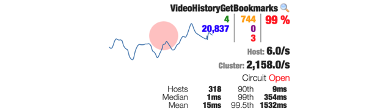

# Hystrix监控台

Hystrix监控台可以实时监控Hystrix指标

当回路打开时会改变颜色（从绿色渐变到黄色、橘色和红色）

Hystrix向监控台打包了很多的信息，这样开发人员可以快速地查到对应的数据

# 参考

> [hystrix-dashboard](https://github.com/Netflix-Skunkworks/hystrix-dashboard/wiki)

