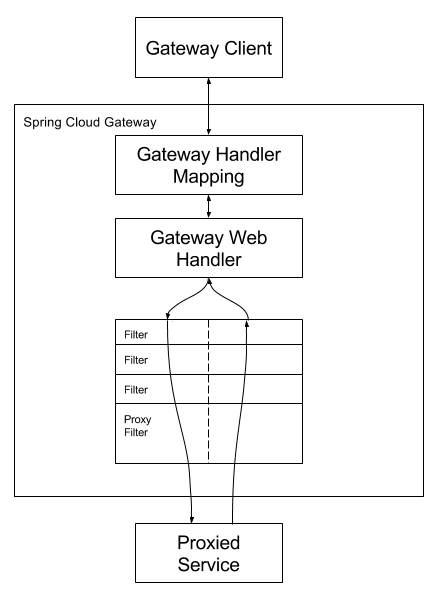

# Spring Cloud Gateway

## 流程图



如果Gateway Handler Mapping发现请求匹配到了Route，会将请求发送到Gateway Web Handler。它会将请求发送到指定的过滤器链。所有的`pre`过滤器逻辑先执行，然后会生成代理请求，之后`post`过滤器逻辑执行

## 名词解释

- **路由**：基本的网关构造模块。由ID、目的URI、predicate集合或过滤器集合组成。当predicate为true时，匹配到相应的路由

- **断言（Predicate）**：类型为[`ServerWebExchange`](https://docs.spring.io/spring/docs/5.0.x/javadoc-api/org/springframework/web/server/ServerWebExchange.html)。可以匹配任何HTTP请求，例如请求头或者参数

- **过滤器（Filter）**：类型为[`GatewayFilter`](https://docs.spring.io/spring/docs/5.0.x/javadoc-api/org/springframework/web/server/GatewayFilter.html)，由特定的工厂类构造。在这里，请求和响应都可以在请求向下发送前或发送后进行修改

## 配置路由断言和网关过滤器

配置断言和过滤器有两种方式，shortcut和fully expanded argument

### shortcut配置

过滤器名称+等号（=）+以逗号分隔的参数

```yaml
spring:
  cloud:
    gateway:
      routes:
      - id: after_route
        uri: https://example.org
        predicates:
        - Cookie=mycookie,mycookievalue
```

### fully expanded argument配置

包含`name`键和``args``键，`arg`键是用来配置predicate或过滤器的键值对

```yaml
spring:
  cloud:
    gateway:
      routes:
      - id: after_route
        uri: https://example.org
        predicates:
        - name: Cookie
          args:
            name: mycookie
            regexp: mycookievalue
```

## 路由断言工厂（Route Predicate Factory）

Spring Cloud Gateway包含多个内建的路由断言工厂。多个路由断言工厂可以通过`and`联合在一起

| Route Predicate Factory | 参数个数 | 参数含义                                                            | 作用                             | 示例                                                                                                     |
| ----------------------- | ---- | --------------------------------------------------------------- | ------------------------------ | ------------------------------------------------------------------------------------------------------ |
| `After`                 | 1    | `datetime`（java`ZonedDateTime`类型）                               | 匹配在指定时间后发生的请求                  | `After=2017-01-20T17:42:47.789-07:00[America/Denver]`                                                  |
| `Before`                | 1    | `datetime`（java`ZonedDateTime`类型）                               | 匹配在指定时间前发生的请求                  | `Before=2017-01-20T17:42:47.789-07:00[America/Denver]`                                                 |
| `Between`               | 2    | `datetime1 `和`datetime2`                                        | 匹配在两个时间段内发生的请求                 | `Between=2017-01-20T17:42:47.789-07:00[America/Denver], 2017-01-21T17:42:47.789-07:00[America/Denver]` |
| `Cookie`                | 2    | `name`和`regexp`（java正则表达式）                                      | 匹配cookies中包含给定的名称，且值需要与正则表达式匹配 | `Cookie=chocolate, ch.p`（匹配请求包含名为chocolate的cookie，且值与`ch.p`表达式匹配）                                      |
| `Header`                | 2    | `name`和`regexp`（java正则表达式）                                      | 匹配header中包含给定的名称，且值需要与正则表达式匹配  | `Header=X-Request-Id, \d+`（匹配请求头包含名称`X-Request-Id`，且值匹配`\d+`正则表达式）                                     |
| `Host`                  | 1    | 一组host名称的模式。模式为Ant类型模式，以`.`分隔                                   | 匹配`Host`Header的值是否与给定的正则表达式匹配  | `Host=.somehost.org,.anotherhost.org`（匹配包含`Host`请求头值为正则表达式的请求）                                         |
| `Method`                | 1    | 以`,`分隔的HTTP方法名                                                  | 匹配指定的请求方法                      | `Method=GET,POST`（匹配请求方法为GET或POST）                                                                     |
| `Path`                  | 2    | Spring`PathMatcher`列表，以及一个可选的`matchOptionalTrailingSeparator`标志 | 匹配请求路径                         | `Path=/foo/{segment},/bar/{segment}`（如果请求路径为`/foo/1`、`/foo/bar`或`/bar/baz`则匹配）                         |
| `Query`                 | 2    | 必须的`param`参数以及可选的`regexp`（java正则表达式）                            | 匹配请求参数                         | `Query=foo, ba.`（匹配请求参数包含`foo`，且值匹配`ba.`正则表达式）                                                         |
| `RemoteAddr`            | 1    | `sources`列表，值为IPv4或IPv6字符串，如`192.168.0.1/16`                    | 匹配请求的远程地址                      | `RemoteAddr=192.168.1.1/24`                                                                            |
| `Weight`                | 2    | `group`和`weight`（整数）                                            | 每个分组会计算权重                      | `Weight=group1, 8`（80%的请求会转发到指定的uri）                                                                   |

## 网关过滤工厂（Gateway Filter Factory）

过滤器可以修改收到的HTTP请求和发出的HTTP响应

| 网关过滤工厂                        | 参数个数 | 参数含义                                                                                                                                                                                                                 | 作用                                                             | 示例                                                                                                                                                                             |
| ----------------------------- | ---- | -------------------------------------------------------------------------------------------------------------------------------------------------------------------------------------------------------------------- | -------------------------------------------------------------- | ------------------------------------------------------------------------------------------------------------------------------------------------------------------------------ |
| `AddRequestHeader`            | 2    | `name`、`value`                                                                                                                                                                                                       | 添加指定`name`的header到请求中                                          | `AddRequestHeader=X-Request-Foo, Bar`（向请求中添加`X-Request-Foo`Header，值为`Bar`）                                                                                                     |
| `AddRequestParameter`         | 2    | `name`、`value`                                                                                                                                                                                                       | 添加指定`name`的参数到请求中                                              | `AddRequestParameter=foo, bar`（向请求参数中添加`foo=bar`）                                                                                                                              |
| `AddResponseHeader`           | 2    | `name`、`value`                                                                                                                                                                                                       | 添加指定`name`的header到响应中                                          | `AddResponseHeader=X-Response-Foo, Bar`（向响应中添加`X-Response-Foo`Header，值为`Bar`）                                                                                                  |
| `DedupeResponseHeader`        | 2    | `name`（包含header名称的list，空格分隔）、`strategy`（可选，可选的值为`RETAIN_FIRST`（默认）、`RETAIN_LAST`、`RETAIN_UNIQUE`）                                                                                                                    | 去掉重复的响应头                                                       | `DedupeResponseHeader=Access-Control-Allow-Credentials Access-Control-Allow-Origin`（去掉响应头中`Access-Control-Allow-Credentials`和`Access-Control-Allow-Origin`中重复的值，防止响应和网关重复增加）   |
| `Hystrix`                     | 1    | `name`、`fallbackUri`（当调用fallback时的操作）                                                                                                                                                                                | 向网关中增加断路器                                                      | `Hystrix=myCommandName`（将剩余的过滤器包装在`HystrixCommand`中，command name为`myCommandName`）                                                                                              |
| `PrefixPath`                  | 1    | `prefix`                                                                                                                                                                                                             | 增加指定路径                                                         | `PrefixPath=/mypath`（如果请求调用`/hello`，则被发送到`/mypath/hello`）                                                                                                                      |
| `PreserveHostHeader`          | 0    |                                                                                                                                                                                                                      | 设置请求属性，路由过滤器通过它来判断是否需要发送原始host的header，而不是http客户端确定的host的header | `PreserveHostHeader`                                                                                                                                                           |
| `RequestRateLimiter`          | n    | 可选的`keyResolver`（实现了`KeyResolver`接口的bean）、速率限制器特定的参数                                                                                                                                                                 |                                                                |                                                                                                                                                                                |
| `RedirectTo`                  | 2    | `status`、`url`                                                                                                                                                                                                       | 转发状态码为`status`，header中`Location`值为`url`                        | `RedirectTo=302, https://acme.org`（发送状态码为302且 header中增加`Location:https://acme.org`执行重定向）                                                                                       |
| `RemoveHopByHopHeadersFilter` | 0    |                                                                                                                                                                                                                      | 移除转发的请求头                                                       |                                                                                                                                                                                |
| `RemoveRequestHeader`         | 1    | `name`                                                                                                                                                                                                               | 移除请求中指定的header                                                 | `RemoveRequestHeader=X-Request-Foo`（发送前移除`X-Request-Foo`header）                                                                                                                |
| `RemoveResponseHeader`        | 1    | `name`                                                                                                                                                                                                               | 移除响应中指定的header                                                 | `RemoveResponseHeader=X-Response-Foo`（在返回网关客户端前移除`X-Response-Foo`header）                                                                                                       |
| `RewritePath`                 | 2    | `regexp`、`replacement`                                                                                                                                                                                               | 使用正则表达式重写请求路径                                                  | `RewritePath=/foo/(?<segment>.*), /$\{segment}`（对于请求路径`/foo/bar`，会在下一步请求前将请求路径设置为`/bar`。需要注意的是：由于在yaml中，`$`需要使用`$\`替换）                                                         |
| `RewriteResponseHeader`       | 3    | `name`、`regexp`、`replacement`                                                                                                                                                                                        | 使用正则表达式重写响应header的值                                            | `RewriteResponseHeader=X-Response-Foo, , password=[^&]+, password=***`（在完成请求后，对于header值`/42?user=ford&password=omg!what&flag=true`，会重写为`/42?user=ford&password=***&flag=true`） |
| `SaveSession`                 | 0    |                                                                                                                                                                                                                      | 在转发调用前会强制执行`WebSession::save`操作                                | `SaveSession`                                                                                                                                                                  |
| `SecureHeaders`               | 0    |                                                                                                                                                                                                                      | 会增加一组header值                                                   |                                                                                                                                                                                |
| `SetPath`                     | 1    | `template`                                                                                                                                                                                                           | 使用模板简单地设置请求路径                                                  | `SetPath=/{segment}`（对于请求路径`/foo/bar`，在执行后续请求时设置路径为`/bar`）                                                                                                                     |
| `SetResponseHeader`           | 2    | `name`、`value`                                                                                                                                                                                                       | 替换指定的header的值为`value`                                          | `SetResponseHeader=X-Response-Foo, Bar`（如果响应包含header`X-Response-Foo:1234`，则会替换为`X-Response-Foo:Bar`）                                                                           |
| `SetStatus`                   | 1    | `status`（必须是`HttpStatus`的有效值，可以为`404`或枚举值`NOT_FOUND`）                                                                                                                                                                | 设置响应状态                                                         | `SetStatus=401`（对任何情况，http响应状态都设置为`401`）                                                                                                                                       |
| `StripPrefix`                 | 1    | `parts`                                                                                                                                                                                                              | path中指定的部分数会在请求下发前被去除                                          | `StripPrefix=2`（如果请求为`/name/bar/foo`，则请求路径会转换为`/foo`）                                                                                                                          |
| `Retry`                       | 4    | `retries`（重试次数）、`statuses`（需要重试的http状态码，参考`org.springframework.http.HttpStatus`值）、`methods`（需要重试的http方法，参考`org.springframework.http.HttpMethod`）、`series`（需要重试的状态码序列，参考`org.springframework.http.HttpStatus.Series`） | 对指定的状态码等进行重试，并指定重试次数                                           |                                                                                                                                                                                |

除了上边这些特定作用的过滤工厂外，也可以增加默认的过滤工厂。可以通过`spring.cloud.gateway.default-filters`来设置

```yaml
spring:
  cloud:
    gateway:
      default-filters:
      - AddResponseHeader=X-Response-Default-Foo, Default-Bar
      - PrefixPath=/httpbin
```

## 全局过滤器


