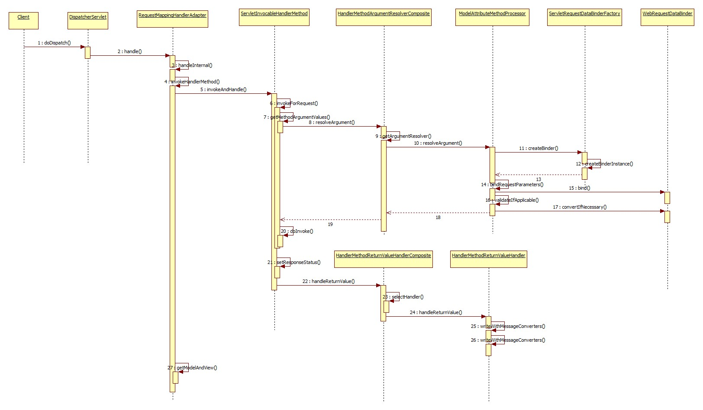
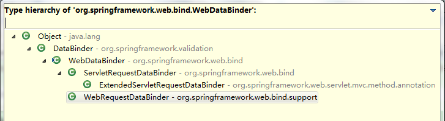

#使用SpringEL实现通用导出#

##背景##
前段时间公司要做一个将页面数据导出到excel的功能，且导出功能分布在各个不同的页面。如果单独在一个页面还好办，但如果导出分布在各个页面，必须要做一个导出框架才能够满足需求了。

##技术选型##
首先是要做到通用，各个页面导出不需要单独再去编码实现，只需要通过配置不同页面的导出列即可实现页面的导出功能。所以重点就在如何配置了。
现在网上查了一圈，没什么结论，毕竟这个是和具体业务相关。只能自己考虑解决办法了。
其实这个需求很简单，显示在页面的数据可以获取到，所以最主要的东西是看如何能够在配置文件中动态的去从数据中获取具体列对应的数据。如果配置文件中能够配置脚本，那通过脚本不就可以动态获取数据了？想到这里差不多就出来了，Spring提供的SpringEL表达式语言正好就能满足需求啊。
具体实现的过程中，也遇到一些问题，比如如何将页面传入的参数转换成具体的类？之前在使用Spring的controller时没有注意，只知道Spring会自动帮你转换成对应的bean。没办法，只能自己找了。
通过Spring代码查看与跟踪，粗略地画了张下面的spirng web调用的序列图


不难看出，由参数转换为bean的主要步骤就是
`ModelAttributeMethodProcessor.resolveArgument()`方法。下面是该方法中主要的内容
```java
	public final Object resolveArgument(MethodParameter parameter, ModelAndViewContainer mavContainer,
			NativeWebRequest webRequest, WebDataBinderFactory binderFactory) throws Exception {

         ……

		WebDataBinder binder = binderFactory.createBinder(webRequest, attribute, name);
		if (binder.getTarget() != null) {
			bindRequestParameters(binder, webRequest);
			validateIfApplicable(binder, parameter);
			if (binder.getBindingResult().hasErrors() && isBindExceptionRequired(binder, parameter)) {
				throw new BindException(binder.getBindingResult());
			}
		}

		……

		return binder.convertIfNecessary(binder.getTarget(), parameter.getParameterType(), parameter);
	}
```

查看`WebDataBinder`的继承关系，可以发现有一个叫做`ServletRequestDataBinder`的类


查看`ServletRequestDataBinder`类的注释，发现有如下说明
> Can also be used for manual data binding in custom web controllers: for example, in a plain Controller implementation or in a MultiActionController handler method. Simply instantiate a ServletRequestDataBinder for each binding process, and invoke bind with the current ServletRequest as argument:
>  MyBean myBean = new MyBean();
>  // apply binder to custom target object
>  ServletRequestDataBinder binder = new ServletRequestDataBinder(myBean);
>  // register custom editors, if desired
>  binder.registerCustomEditor(...);
>  // trigger actual binding of request parameters
>  binder.bind(request);
>  // optionally evaluate binding errors
>  Errors errors = binder.getErrors();

这个就是Spring提供给我们来进行参数转换到bean的类，但如果按照这样来实现的话就真是图样图森破了。

再次查看`ModelAttributeMethodProcessor.resolveArgument()`方法，进入到createBinder方法里，发现不只是构造了一个WebDataBinder的实例，还对该binder进行了初始化

下面是`DefaultDataBinderFactory.createBinder()`方法
```java
	public final WebDataBinder createBinder(NativeWebRequest webRequest, Object target, String objectName)
			throws Exception {

		WebDataBinder dataBinder = createBinderInstance(target, objectName, webRequest);
		if (this.initializer != null) {
			this.initializer.initBinder(dataBinder, webRequest);
		}
		initBinder(dataBinder, webRequest);
		return dataBinder;
	}
```
再进入initBinder方法，就发现Spring根据不同的条件，对binder做了很多的设置
```java
	public void initBinder(WebDataBinder binder, WebRequest request) {
		binder.setAutoGrowNestedPaths(this.autoGrowNestedPaths);
		if (this.directFieldAccess) {
			binder.initDirectFieldAccess();
		}
		if (this.messageCodesResolver != null) {
			binder.setMessageCodesResolver(this.messageCodesResolver);
		}
		if (this.bindingErrorProcessor != null) {
			binder.setBindingErrorProcessor(this.bindingErrorProcessor);
		}
		if (this.validator != null && binder.getTarget() != null &&
				this.validator.supports(binder.getTarget().getClass())) {
			binder.setValidator(this.validator);
		}
		if (this.conversionService != null) {
			binder.setConversionService(this.conversionService);
		}
		if (this.propertyEditorRegistrars != null) {
			for (PropertyEditorRegistrar propertyEditorRegistrar : this.propertyEditorRegistrars) {
				propertyEditorRegistrar.registerCustomEditors(binder);
			}
		}
	}
```

##代码实现##
以下java代码均将import省略

导出控制类
```java

/**
 * 导出控制类，用来实现通用的导出功能
 */
@Controller
public class ExportController implements InitializingBean {
	static class ExportType {
		String bean;
		Map<String, String> columnValueMap = Maps.newLinkedHashMap();
		String exportName;
	}
	private static final String COLUMN="column";
	private static final String EXPORTNAME="exportname";
    private Map<String, ExportType> typeMap;

	// 解析配置文件获取导出信息，包括导出列，导出文件名称等
    @Override
	public void afterPropertiesSet() throws Exception {
    	Map<String, ExportType> tmpTypeMap = Maps.newHashMap();
    	final String confFile = "conf/export.properties";
        final ClassLoader loader = getClass().getClassLoader();
        List<String> lines = FileUtils.readLines(new File(loader.getResource(confFile).toURI()));
        lines.stream().filter(line->!line.startsWith("#") && !line.trim().equals("")).forEach(line-> {
        	String[] splits = line.split("=", 2);
        	String key = splits[0];
        	String value = splits[1];
        	splits = key.split("\\.");
			String typeName = splits[0];
			ExportType type;
			if (!tmpTypeMap.containsKey(typeName)) {
        		type = new ExportType();
        		tmpTypeMap.put(typeName, type);
        	}
        	type = tmpTypeMap.get(typeName);
			if (splits.length == 1) {
        		type.bean = value;
        	} else {
				if (key.contains(COLUMN)) {
        			String[] split = key.split("\\.");
        			type.columnValueMap.put(split[split.length - 1], value);
				} else if (key.endsWith(EXPORTNAME)) {
					type.exportName = value;
				}
        	}
        });
        typeMap = Collections.unmodifiableMap(tmpTypeMap);
	}

    @RequestMapping("/export")
    @Authorization
    public ResponseEntity<byte[]> export(Long userId, @RequestParam("exportType")String type, String[] column, HttpServletRequest request, HttpServletResponse resp) throws IOException {
    	File excelFile = null;
    	request.setAttribute("exportType", type);
    	SpelExpressionParser parser = new SpelExpressionParser();
    	ExportType exportType = typeMap.get(type);

    	// 根据配置的bean名称获取对应的controller
		Object controllerBean = SpringContextUtil.getBean(exportType.bean);
		StandardEvaluationContext context = new StandardEvaluationContext();
		List<String> columnsToExport = Lists.newArrayList(exportType.columnValueMap.keySet());
		if (column != null && column.length > 0) {
			columnsToExport = Arrays.asList(column);
		}

		// 所有支持导出的controller都需要实现Exportable接口来获取导出数据
    	if (controllerBean instanceof Exportable) {
    		Exportable<?> exportable = (Exportable<?>) controllerBean;
    		Page<?> exportData = exportable.getExportData(userId, request);
    		List<?> elements = exportData.getElements();

    		// 需要导出的、经过SpringEL解析的值
    		List<List<Object>> allValues = Lists.newArrayList();

			if (elements != null && elements.size() > 0) {
				List<String> valuesToExport = Lists.newArrayList();
				columnsToExport.forEach(tmpColumn-> {
					valuesToExport.add(exportType.columnValueMap.get(tmpColumn));
				});

				// 支持自定义方法的配置来对原始数据进行自定义显示
				// 先默认自定义的方法不会重载
				// 自定义方法格式：#formatDate(payTime) 方法为formatDate，参数为payTime
				valuesToExport.stream().filter(value->value.indexOf('#') >= 0 && value.indexOf('(') > 0).forEach(value -> {
					int leftB = value.indexOf('(');
					int rigthB = value.indexOf(')', leftB);
					String function = value.substring(value.indexOf('#')+1, leftB);
					String[] params = value.substring(leftB + 1, rigthB).split(",");
					try {

						// 自定义的方法都放在ExportFunctions类里
						Method[] methods = ExportFunctions.class.getDeclaredMethods();
						List<Method> methodList = Arrays.stream(methods).filter(m->m.getName().equals(function)).collect(Collectors.toList());
						for (Method tmpMethod : methodList) {
							if (tmpMethod.getParameterCount() == params.length) {
								context.registerFunction(function, tmpMethod);
								break;
							}
						}
					} catch (SecurityException e) {
						Logs.error("", e);
					}
				});

				elements.forEach(element -> {
					context.setRootObject(element);
					List<Object> rowValues = Lists.newArrayList();
					valuesToExport.stream().forEach(value -> {
						try {
							rowValues.add(parser.parseExpression(value).getValue(context));
						} catch (Exception e) {
							Logs.info("Error occurred while parsing {}.", value);
							throw e;
						}
					});
					allValues.add(rowValues);
				});
			}

			// 获取到所有的列名和值，通过ExcelUtils导出到excel
			try {
				excelFile = ExcelUtils.generateExcelFile(exportType.exportName, columnsToExport, allValues);
			} catch (Exception e) {
				Logs.error("Error occurred when generate excel file while exporting!", e);
			}
		}

		// 返回导出的excel，直接下载
    	HttpHeaders headers = new HttpHeaders();  
        headers.setContentType(MediaType.APPLICATION_OCTET_STREAM);  
        headers.setContentDispositionFormData("attachment", URLEncoder.encode(exportType.exportName, "utf-8")); 
        if (excelFile != null) {
        	return new ResponseEntity<byte[]>(FileUtils.readFileToByteArray(excelFile),  
        			headers, HttpStatus.CREATED);
		}

        throw new AppException(ErrorCode.ERR_SYSTEM);
    }
}

```

所有自定义方法都在ExportFunctions类里定义，其实就是包含了一堆静态方法的普通类
```java
public final class ExportFunctions {
	/**
	 * 格式化时间为yyyy-MM-dd HH:mm
	 * @param date
	 * @return
	 */
	public static String formatDate(Date date) {
		return formatDate(date, "yyyy-MM-dd HH:mm");
	}
	private static String formatDate(Date date, String pattern) {
		if (date != null) {
			return new SimpleDateFormat(pattern).format(date);
		} else {
			return "";
		}
	}
}
```
`Exportable`接口，核心功能是将request参数转换为具体的bean
```java
/**
 * controller实现该接口来提供导出功能
 *
 * @param <T>
 */
public interface Exportable<T> {
	/**
	 * 组合参数，返回需要导出的数据
	 * @param userId
	 * @param request
	 * @return
	 */
	Page<T> getExportData(Long userId, HttpServletRequest request);

	/**
	 * 获取默认的binder
	 * @param target 需要将数据绑定的对象
	 * @param request
	 * @return
	 */
	default <O> ServletRequestDataBinder initDataBinder(O target, HttpServletRequest request) {
		ServletRequestDataBinder binder = new ServletRequestDataBinder(target);
		binder.setConversionService(new DefaultConversionService());
		binder.bind(request);
		return binder;
	}
}
```

导出的配置文件
```
portalorder=portalOrderController
portalorder.column.下单时间=#formatDate(createTime)
portalorder.column.订单号=serialNumber
portalorder.exportname=平台收款订单列表.xls
```
最后是需要导出的Controller，在getExportData中调用initDataBinder完成request参数到具体的bean的转换
```java
    @Override
    public Page<DeliverApply> getExportData(Long userId, HttpServletRequest request) {
    	ListQuery query = new ListQuery();
    	initDataBinder(query, request);
        ……具体业务逻辑
    }
```
