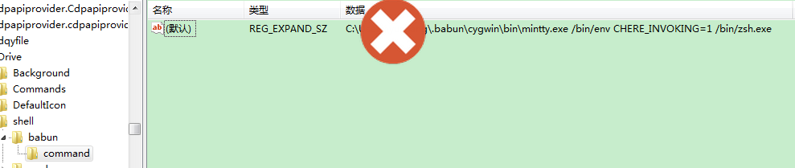

#babun使用
windows下模拟linux环境当然是用[babun](http://babun.github.io/)了，这里列出了我自己使用的一些习惯配置。

- babun使用代理上网
	公司上网需要设置代理，可以通过修改~/.babunrc文件，然后执行`source ~/.babunrc`使之生效
- totalcmd集成babun
	在windows下一直用totalcmd，但安装完后babun默认是集成进资源管理器右键，可以通过开始->更改开始菜单来增加一个babun的菜单，其中的命令、参数可以在注册表里找到，如图

	复制下内容，命令就是mintty.exe前的字符串，参数就是剩下的字符串，菜单标题可以设置为b&abun，注意a之前增加了一个&符号，用来定义加速键
- babun下使用fish
	首先是在babun下安装fish，使用命令`pact install fish`即可，安装完成后可以使用`pact show|grep fish`查看是否安装成功
    其次是让babun默认使用fish，linux下可以使用`chsh -s `加fish路径修改fish为默认shell，如果不知道fish路径，可以执行`less /etc/shells`来查看fish路径，babun下没有办法这样操作，但刚刚在totalcmd下集成babun时我们输入的命令是这样子的`/bin/env CHERE_INVOKING=1 /bin/zsh.exe`，可以仿造它来修改默认shell，在babun下查看是否有/bin/fish.exe，果然没有猜错，修改命令为`/bin/env CHERE_INVOKING=1 /bin/fish.exe`,重启babun，哈哈，又开始fish了
