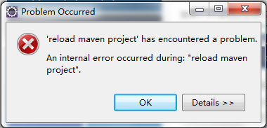

#eclipse启动报错
前一段时间遇到一个奇怪的现象，在eclipse中导入了一个maven工程后，由于编译太慢，退出eclipse并杀掉了eclipse进程。结果再启动时eclipse报错

点击确定之后，eclipse界面无法看到，但后台eclipse进程还在。

百度了一下后，找到了解决方案：
1. 进入eclipse的workspace目录
2. 编辑.metadata\.plugins\org.eclipse.e4.workbench\workbench.xmi文件，查找有问题的工程名称，并进行删除。最好是一边用ie打开，一边删除，删除后在ie界面刷新，保证没有误操作。*切记操作之前备份workbench.xmi文件*
3. 重启eclipse

看来所有软件都不是完美的，只能做到尽可能完美！