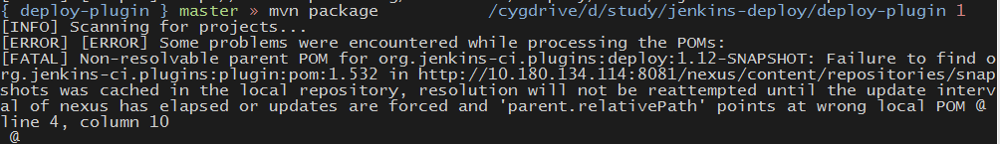

#关于Jenkins的deploy plugin不支持Tomcat8的问题

##背景
最近项目终于使用Jenkins作为自动化部署工具了，但发现jenkins的deploy plugin从官网上下载的最新版本只支持到Tomcat7，而项目使用的是Tomcat8。让 项目Tomcat降级为7可能性不大，也想过在github上的[deploy plugin](https://github.com/jenkinsci/deploy-plugin)拉分支来开发使其支持Tomcat8，结果发现其实已经有人做了这部分工作了，又可以坐享其成了

##操作步骤
1.将deploy plugin下载下来
`git clone https://github.com/jenkinsci/deploy-plugin.git`
2.执行`mvn package`
报错

大概是说parent pom无法处理，google了一下，找到了解决方案
[Failure to find org.jenkins-ci.plugins:plugin](http://dustint.com/post/327/failure-to-find-org.jenkins-ci.pluginsplugin)
按照上面说的，将本机的maven的setting文件增加如下内容
```xml
<profiles>
	<profile>
     <id>jenkins</id>
     <activation>
       <activeByDefault>true</activeByDefault>
     </activation>
     <repositories>
       <repository>
         <id>java.net-m2-repository</id>
         <url>http://maven.jenkins-ci.org:8081/content/repositories/releases/
         </url>
       </repository>
     </repositories>
     <pluginRepositories>
       <pluginRepository>
         <id>jenkins-m2-repository</id>
         <name>Jenkins Plugin Repository</name>
         <url>http://maven.jenkins-ci.org:8081/content/repositories/releases/</url>
         <layout>default</layout>
       </pluginRepository>
       <pluginRepository>
          <id>maven.jenkins-ci.org</id>
          <url>http://maven.glassfish.org/content/groups/public/</url>
        </pluginRepository>
     </pluginRepositories>
	</profile>
</profiles>
```
再次执行`mvn package`